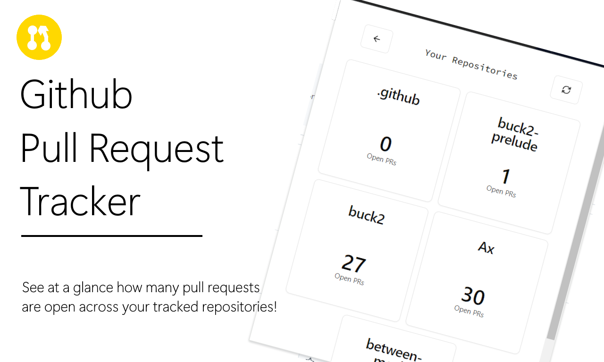

# Note: WORK IN PROGRESS

# Github PR Tracker Chrome Extension

  

Chrome extension that displays the number of open pull requests across tracked repositories (note: public repos only at current but this may change).

Built in React with TypeScript using Vite, utilising [shadcn/ui](https://ui.shadcn.com) components using tailwind on the frontend.

To-do: include link to chrome web store listing when out here

## How to Use

1). [Download the extension]('') from the chrome web store or [load an unpacked build](#local-setup) of the extension

  
2). Choose the 'Enter Github Username' option
 

 
Alternatively, choose the 'Enter Github Username and PAT' to make authenticated requests, [this approach is discussed here]('')
  

3). Select the Repositories You Wish to Track

4). Voila! If you want to refresh your pull request repo details, press the refresh button

# Authenticated Approach

You can generate a Personal Access Token (classic) with no additional permissions <a target="_blank" href="https://docs.github.com/en/authentication/keeping-your-account-and-data-secure/managing-your-personal-access-tokens#creating-a-personal-access-token-classic">following Github's guide here (opens new tab)</a>

# Local Setup

1). Install Node Package Manager (bundled with node) and clone the repository

2). Navigate into the repository directory and install dependencies with `npm install`

3). Run `npm run build`

4). In Chrome, go to chrome://extensions and enable "Developer mode" in the top-right corner.

5). Click the "<em>Load unpacked</em>" button and select the generated `dist/` directory

## FAQ/Gotchas

To be completed
