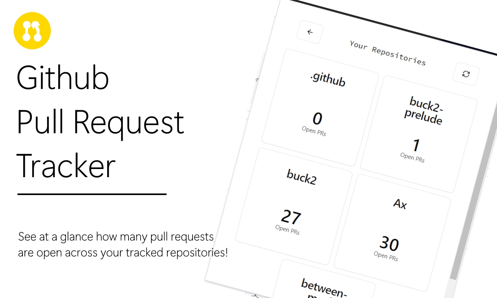

# Note: WORK IN PROGRESS

# Github PR Tracker Chrome Extension

  

Chrome extension that displays the number of open pull requests across tracked repositories (note: public repos only at current but this may change).

Built in React with TypeScript using Vite, utilising [shadcn/ui](https://ui.shadcn.com) components using tailwind on the frontend.

To-do: include link to chrome web store listing when out here

## How to Use

	

 

1). [Download the extension]('') from the chrome web store or [load an unpacked build](#local-setup) of the extension

2). Choose the 'Enter Github Username' option, alternatively you can choose the 'Enter Github Username and PAT' to make authenticated requests, [this approach is discussed here]('#Authenticated Approach')

3). Select the Repositories You Wish to Track

4). Voila! If you want to refresh your pull request repo details, press the refresh button

# Authenticated Approach

You can generate a Personal Access Token (classic) with no additional permissions <a target="_blank" href="https://docs.github.com/en/authentication/keeping-your-account-and-data-secure/managing-your-personal-access-tokens#creating-a-personal-access-token-classic">following Github's guide here (opens new tab)</a>

# Local Setup

1). Install Node Package Manager (bundled with node) and clone the repository. An `.nvmrc` is included, so if you use `nvm` run `nvm use` to pick up the correct Node version.

2). Navigate into the repository directory and install dependencies with `npm install`

3). Run `npm run build`

4). In Chrome, go to chrome://extensions and enable "Developer mode" in the top-right corner.

5). Click the "<em>Load unpacked</em>" button and select the generated `dist/` directory

# Development

- `npm run dev` — starts a Vite dev server for iterating on the popup UI. This only renders the React app in a browser tab; the service worker/alarm/polling behaviour can only be exercised by loading `dist/` as an unpacked extension (see [Local Setup](#local-setup)).
- `npm run lint` / `npm run lint-fix` — lint with `xo` (prettier-integrated)
- `npm run pretty-check` / `npm run pretty-format` — check/write formatting with prettier
- `npm test` — runs `test:unit`, `test:it`, then `test:end` in sequence. See [Testing](#testing) below before running this.
- Commit messages follow a specific short, prefixed convention (`chore:`/`fix:`, small focused diffs) — see the "Git conventions" section in [CLAUDE.md](CLAUDE.md) if you're contributing.

## Testing

- `npm run test:unit` — Jest unit tests (`**/*.unit.test.ts`)
- `npm run test:it` — Jest integration tests (`**/*.it.test.ts`) — currently empty, reserved for future use
- `npm run test:end` — Puppeteer end-to-end tests (`**/*.end.test.ts`)

The e2e suite needs a fresh `dist/` build to run against and launches a real (non-headless) Chrome window, and it currently hits the live GitHub API rather than the mock JSON server — see [FAQ/Gotchas](#faqgotchas) for details before running it.

## Git hooks (husky)

- `pre-commit` auto-formats staged files with prettier **and runs `npm audit`** — a commit can be blocked by an unrelated dependency vulnerability, not just your changes.
- `pre-push` runs a full `npm run build` to confirm the extension still builds.

## FAQ/Gotchas

**`npm run test:end` (or `npm test`) fails or loads an old version of the extension** — the e2e suite loads the extension straight from `dist/`, so run `npm run build` first. Also note Puppeteer runs with `headless: false` here, so it'll pop open a real Chrome window locally; use `npm run docker-run` (or `docker-setup`) to run it headlessly/reliably instead.

**e2e tests fail with rate-limit errors that don't look related to my change** — despite the `json-server` mock backed by `data/db.json`, the e2e test currently queries the real GitHub API unauthenticated (e.g. the `facebook` org), so it's subject to GitHub's 60 requests/hour unauthenticated rate limit. Repeated local runs or a shared CI IP can trip this. Switching the e2e suite over to the JSON mock server is planned.
